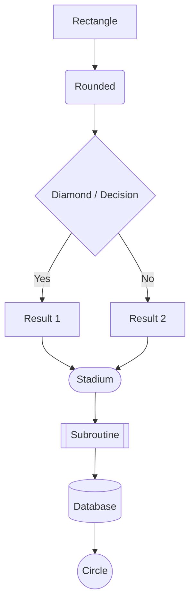
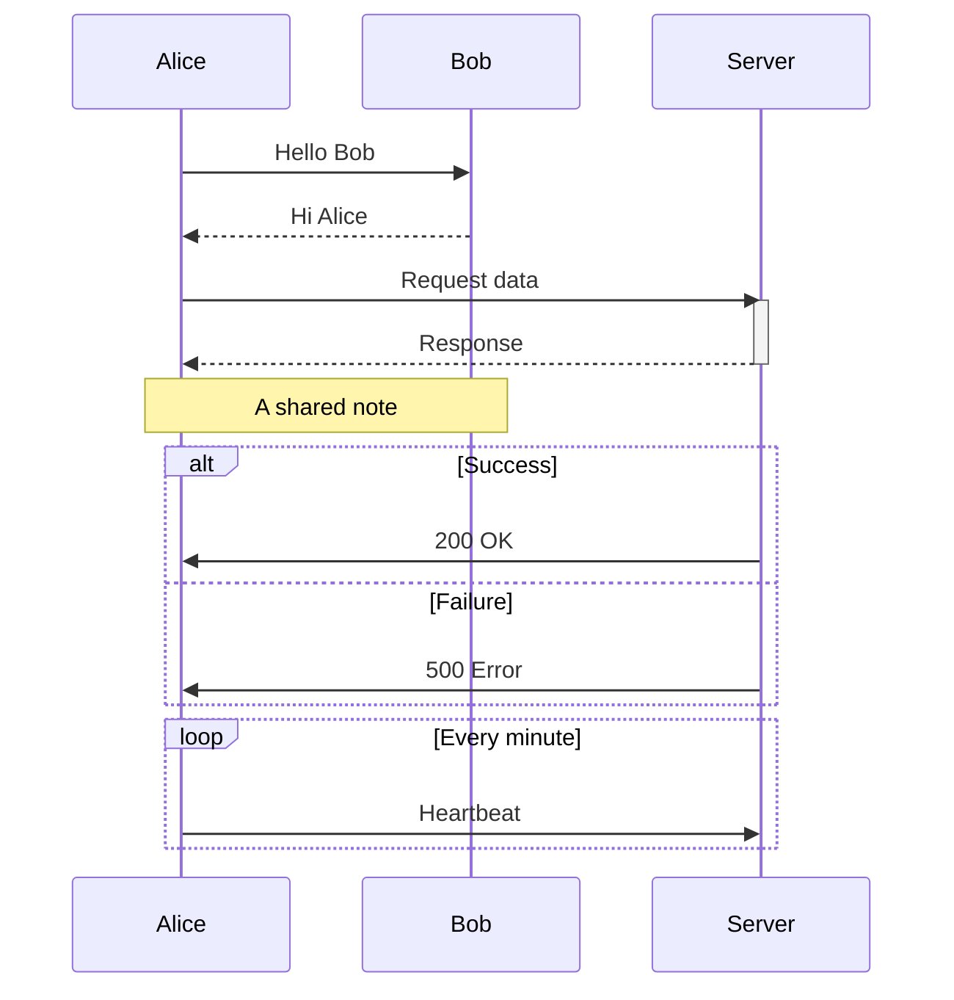
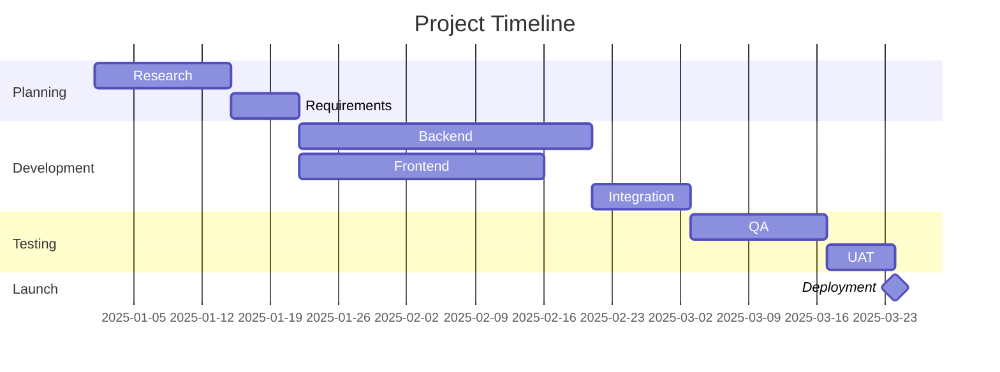
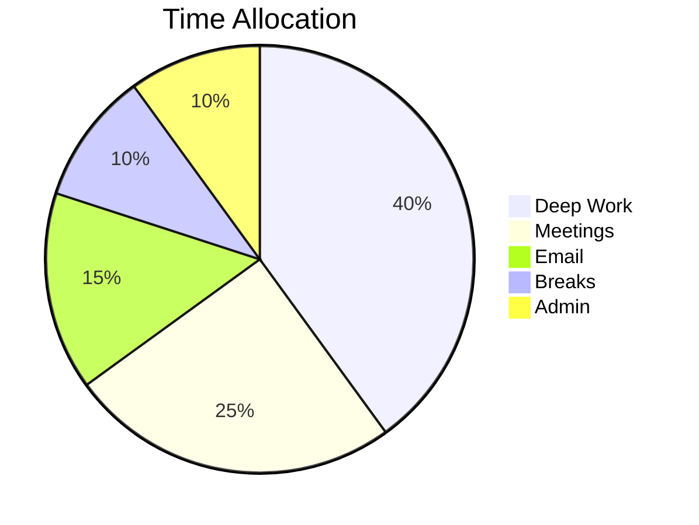
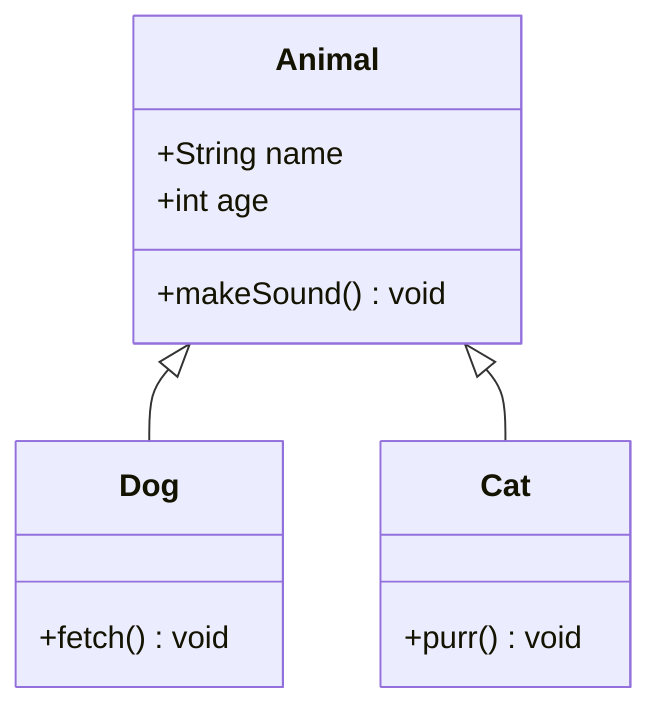
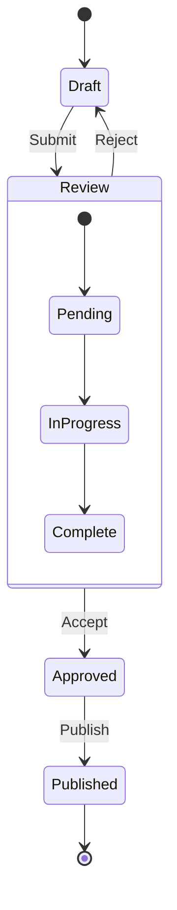
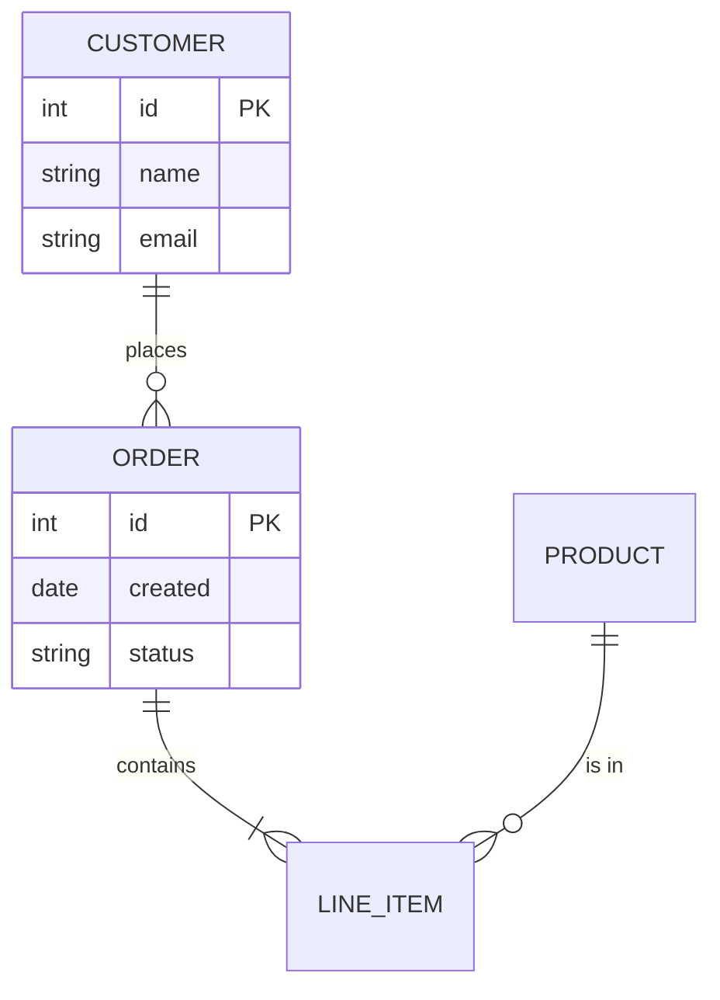
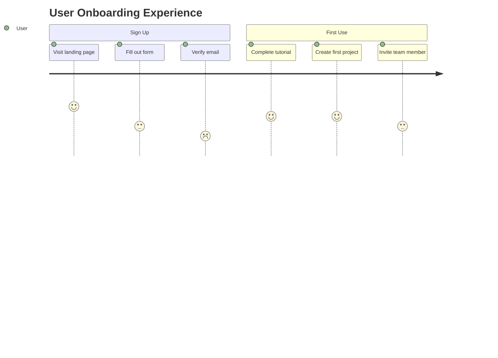

# The Complete Obsidian Markdown Guide

## Everything You Need to Know About Writing in Obsidian

---

# 1 — Internal Linking

Internal links are the foundation of Obsidian. They create the connections that turn a collection of notes into a knowledge graph.

---

## 1.1 Basic Wikilinks

```markdown
[[Note Name]]
```

- Links to a note by its filename (without the `.md` extension).
- If the note doesn't exist yet, the link appears in a dimmed/ghost style. Clicking it creates the note.
- Case-insensitive matching: `[[my note]]` will find `My Note.md`.
- If multiple notes share the same name, Obsidian uses the shortest path. You can disambiguate with a path prefix: `[[Folder/Note Name]]`.

---

## 1.2 Display Text (Aliases in Links)

```markdown
[[Note Name|Displayed text]]
```

The pipe `|` separates the target from the display text. The link points to "Note Name" but renders as "Displayed text."

```markdown
Read more about [[Spaced Repetition|how spaced repetition works]].
Check the [[2025-01-15|meeting notes from January 15th]].
```

---

## 1.3 Heading Links

Link to a specific heading within any note:

```markdown
[[Note Name#Heading Text]]
[[Note Name#Heading Text|Custom display]]
```

Link to a heading in the current note:

```markdown
[[#Heading in This Note]]
[[#Heading in This Note|Jump to that section]]
```

### Heading Link Behavior

- Heading matching is case-insensitive.
- If a heading contains special characters, type them as-is: `[[Note#What's New?]]`.
- If multiple headings have the same text, Obsidian appends a number: `#Duplicate Heading`, `#Duplicate Heading 1`, etc.
- Nested heading targeting: `[[Note#Parent Heading#Child Heading]]` is NOT supported. Target the specific heading directly.

---

## 1.4 Block References

Block references let you link to any specific paragraph, list item, or other block-level element.

### Creating a Block ID

Append `^identifier` to the end of any block:

```markdown
This is a specific paragraph I want to reference later. ^my-paragraph

- This list item can be referenced too. ^list-ref
```

- Block IDs can contain letters, numbers, and hyphens. No spaces.
- The `^id` must be at the very end of the line, separated by a space.
- Block IDs are invisible in reading view.

### Linking to a Block

```markdown
[[Note Name#^block-id]]
[[Note Name#^block-id|Display text]]
```

Link to a block in the current note:

```markdown
[[#^block-id]]
```

### Auto-Generated Block IDs

When you type `[[Note#^` and select a block from the autocomplete popup, Obsidian auto-generates a random alphanumeric ID (like `^a1b2c3`) and appends it to the target block if one doesn't already exist.

---

## 1.5 Link Autocomplete

Typing `[[` triggers the link suggestion popup:

- `[[` → Shows all notes in the vault.
- `[[partial` → Filters to notes matching "partial."
- `[[Note#` → Shows headings in "Note."
- `[[Note#^` → Shows blocks in "Note."
- `[[#` → Shows headings in the current note.
- `[[#^` → Shows blocks in the current note.

---

## 1.6 Markdown-Style Links

Obsidian also supports standard Markdown links:

```markdown
[Display text](Note%20Name.md)
[Display text](Note%20Name.md#heading)
[Display text](Folder/Note%20Name.md)
```

- Spaces must be encoded as `%20`.
- The `.md` extension is required.
- Less ergonomic than wikilinks but more portable to other tools.

You can toggle wikilinks on/off in **Settings → Files & Links → Use `[[Wikilinks]]`**. When off, Obsidian generates Markdown-style links by default.

---

## 1.7 Unlinked Mentions

Obsidian's backlinks pane shows two sections:

- **Linked mentions** — Notes that explicitly link to the current note.
- **Unlinked mentions** — Notes that contain the current note's filename as plain text but don't link to it.

You can click an unlinked mention to convert it into a formal link.

**Aliases** (defined in frontmatter) expand unlinked mention detection:

```yaml
---
aliases:
  - ML
  - machine learning
---
```

Now any note containing "ML" or "machine learning" as text will appear in unlinked mentions for this note.

---

# 2 — Embeds and Transclusion

Embeds pull content from other notes (or files) directly into the current note. The prefix `!` before a wikilink makes it an embed.

---

## 2.1 Embedding Notes

### Entire Note

```markdown
![[Note Name]]
```

Renders the full content of "Note Name" inline in the current note.

### Specific Heading Section

```markdown
![[Note Name#Heading]]
```

Embeds everything from that heading until the next heading of the same or higher level.

### Specific Block

```markdown
![[Note Name#^block-id]]
```

Embeds only that single block.

---

## 2.2 Embedding Images

```markdown
![[photo.png]]
![[photo.jpg]]
![[diagram.svg]]
```

### Resizing Images

```markdown
![[image.png|400]]
```

Sets the width to 400 pixels. Height scales proportionally.

```markdown
![[image.png|400x300]]
```

Sets both width (400px) and height (300px) explicitly.

### External Images

Standard Markdown image syntax for external URLs:

```markdown

```

Resize external images with HTML:

```markdown

```

### Supported Image Formats

`png`, `jpg`/`jpeg`, `gif`, `bmp`, `svg`, `webp`

---

## 2.3 Embedding PDFs

```markdown
![[document.pdf]]
```

### Specific Page

```markdown
![[document.pdf#page=5]]
```

### Page Range (rendered as scrollable)

```markdown
![[document.pdf#page=3]]
```

### Resize the PDF Viewer

```markdown
![[document.pdf#height=400]]
![[document.pdf#page=2&height=600]]
```

Height is in pixels.

---

## 2.4 Embedding Audio

```markdown
![[recording.mp3]]
![[podcast.wav]]
![[interview.m4a]]
![[clip.ogg]]
![[audio.webm]]
![[sound.flac]]
![[track.3gp]]
```

Renders an inline audio player.

---

## 2.5 Embedding Video

```markdown
![[video.mp4]]
![[clip.webm]]
![[recording.ogv]]
![[movie.mkv]]
```

Renders an inline video player.

---

## 2.6 Embedding Web Pages (iframes)

```markdown
<iframe src="https://example.com" width="100%" height="400"></iframe>
```

Useful for embedding YouTube, Google Maps, or other web content. Not all sites allow iframe embedding due to security policies.

---

## 2.7 Embed Behavior Notes

- Embeds are live: if the source note changes, the embed updates immediately.
- Embeds are read-only in reading view. In editing view, you see the embed syntax.
- Deeply nested embeds (embed within an embed) are supported but can impact performance.
- Circular embeds (A embeds B, B embeds A) are detected and stopped by Obsidian.

---

# 3 — Tags

---

## 3.1 Inline Tags

```markdown
#tag
#project
#status/active
#my-tag
#CamelCaseTag
#tag_with_underscores
#2025project
```

### Tag Rules

- Must start with a letter or underscore (not a number).
- Can contain: letters, numbers, hyphens `-`, underscores `_`, forward slashes `/`.
- Cannot contain: spaces, punctuation (other than `-`, `_`, `/`).
- Case-insensitive for search purposes: `#Project` and `#project` are the same tag.
- Cannot be used inside code blocks or inline code (they render literally).
- Must be preceded by a space, newline, or be at the start of a line (no mid-word tagging).

### Nested (Hierarchical) Tags

```markdown
#project/alpha
#project/beta
#status/active
#status/complete
#area/health/exercise
```

- Forward slashes create a hierarchy.
- Searching `#project` returns notes with `#project`, `#project/alpha`, `#project/beta`, etc.
- Searching `#project/alpha` returns only that specific tag.

---

## 3.2 Frontmatter Tags

```yaml
---
tags:
  - project
  - reference
  - status/active
---
```

Inline YAML syntax:

```yaml
---
tags: [project, reference, status/active]
---
```

- Frontmatter tags don't use the `#` prefix.
- They're functionally identical to inline tags for search and filtering.
- Best for "metadata" tags that classify the entire note.

---

## 3.3 Tag Pane

The tag pane (**View → Tags**) shows all tags in the vault with counts. Clicking a tag opens a search for it. Nested tags display hierarchically and can be collapsed.

---

# 4 — Callouts

Callouts are Obsidian's styled admonition blocks, built on top of blockquote syntax.

---

## 4.1 Basic Callout

```markdown
> [!note]
> This is a note callout. The first line after [!type] becomes the body.
```

### With a Custom Title

```markdown
> [!tip] Pro Tip
> You can give any callout a custom title.
```

### Without a Title (Title Hidden)

```markdown
> [!info]-
> A collapsed callout with no title text shows just the type name.
```

---

## 4.2 Foldable Callouts

```markdown
> [!warning]- Collapsed by Default
> Content is hidden until the user clicks to expand.

> [!warning]+ Expanded by Default (but Collapsible)
> Content is visible but can be collapsed by clicking.
```

- `-` after the type = collapsed by default.
- `+` after the type = expanded by default, but still foldable.
- No symbol = always open, not foldable.

---

## 4.3 Complete Callout Type Reference

| Type       | Icon           | Color  | Aliases                |
| ---------- | -------------- | ------ | ---------------------- |
| `note`     | Pencil         | Blue   | —                      |
| `abstract` | Clipboard      | Teal   | `summary`, `tldr`      |
| `info`     | Info circle    | Blue   | —                      |
| `todo`     | Checkbox       | Blue   | —                      |
| `tip`      | Flame          | Cyan   | `hint`, `important`    |
| `success`  | Check          | Green  | `check`, `done`        |
| `question` | Help circle    | Yellow | `help`, `faq`          |
| `warning`  | Alert triangle | Orange | `caution`, `attention` |
| `failure`  | X              | Red    | `fail`, `missing`      |
| `danger`   | Zap            | Red    | `error`                |
| `bug`      | Bug            | Red    | —                      |
| `example`  | List           | Purple | —                      |
| `quote`    | Quote mark     | Gray   | `cite`                 |

All types and their aliases are interchangeable:

```markdown
> [!tldr]
> Same as [!abstract] and [!summary].
```

---

## 4.4 Callout Content

Callouts support full Markdown inside them:

````markdown
> [!example] Complex Callout
> **Bold**, _italic_, and `code` all work.
>
> - Lists work too
> - Including nested ones
>   - Like this
>
> > Nested blockquotes
>
> ```python
> # Even code blocks
> print("Hello from inside a callout")
> ```
>
> | Tables | Also | Work |
> | ------ | ---- | ---- |
> | Yes    | They | Do   |
>
> ![[embedded-image.png]]
>
> [[Links work too]]
````

---

## 4.5 Nested Callouts

```markdown
> [!question] Outer callout
> Some content here.
>
> > [!success] Inner callout
> > Nested one level deep.
> >
> > > [!note] Even deeper
> > > Three levels deep.
```

Each nesting level adds another `>`.

---

## 4.6 Custom Callouts (via CSS)

You can define custom callout types in a CSS snippet:

```css
/* Save as .obsidian/snippets/custom-callouts.css */
.callout[data-callout="recipe"] {
  --callout-color: 255, 145, 0;
  --callout-icon: lucide-chef-hat;
}

.callout[data-callout="workout"] {
  --callout-color: 50, 205, 50;
  --callout-icon: lucide-dumbbell;
}
```

Then use them:

```markdown
> [!recipe] Pasta Carbonara
> Ingredients and instructions here.

> [!workout] Today's Session
> Exercises here.
```

Enable the snippet in **Settings → Appearance → CSS Snippets**.

---

# 5 — Properties (YAML Frontmatter)

Properties are structured metadata for your notes, defined in YAML frontmatter at the very top of the file.

---

## 5.1 Basic Syntax

```yaml
---
key: value
---
```

The `---` delimiters must be the very first thing in the file (no blank lines or content before it).

---

## 5.2 Data Types

### Text

```yaml
---
title: "My Note Title"
description: A short description without quotes
---
```

Quotes are optional for simple strings. Use them when the value contains colons, special YAML characters, or leading/trailing spaces.

### Numbers

```yaml
---
rating: 4
weight: 72.5
---
```

### Booleans

```yaml
---
publish: true
draft: false
---
```

### Dates and Date-Times

```yaml
---
date: 2025-01-15
created: 2025-01-15T14:30:00
---
```

### Lists

```yaml
---
tags:
  - tag1
  - tag2
  - tag3

# Inline list syntax (equivalent)
tags: [tag1, tag2, tag3]
---
```

### Links as Properties

```yaml
---
related:
  - "[[Note A]]"
  - "[[Note B]]"
source: "[[Literature Note]]"
---
```

Wrap wikilinks in quotes inside YAML to prevent parsing errors.

---

## 5.3 Obsidian's Reserved/Special Properties

| Property      | Type    | Purpose                                                       |
| ------------- | ------- | ------------------------------------------------------------- |
| `tags`        | List    | Note tags (no `#` prefix)                                     |
| `aliases`     | List    | Alternative names for link autocomplete and unlinked mentions |
| `cssclasses`  | List    | CSS classes applied to the note in reading view               |
| `publish`     | Boolean | Controls visibility on Obsidian Publish                       |
| `permalink`   | Text    | Custom URL path for Obsidian Publish                          |
| `description` | Text    | Used by some themes and Obsidian Publish for metadata         |
| `image`       | Text    | Cover image for Obsidian Publish                              |
| `cover`       | Text    | Cover image (some themes)                                     |

---

## 5.4 Custom Properties

You can define any custom key-value pairs. These are especially powerful when combined with Dataview or other query plugins:

```yaml
---
status: in-progress
priority: high
project: "[[Project Alpha]]"
due: 2025-03-01
effort: 3
assignee: "Alice"
category: reference
---
```

---

## 5.5 Properties View

Obsidian has a visual Properties editor at the top of notes (when enabled). You can:

- Add, edit, and delete properties visually.
- Set property types globally (text, number, date, checkbox, etc.) via **Settings → Properties**.
- Once a type is set for a property name, Obsidian enforces it across all notes.

---

# 6 — Math and Equations

Obsidian uses MathJax (with KaTeX-like rendering) for LaTeX math typesetting.

---

## 6.1 Inline Math

```markdown
The Pythagorean theorem states $a^2 + b^2 = c^2$.
```

Surround expressions with single dollar signs `$...$`. No spaces immediately after the opening `$` or before the closing `$`.

---

## 6.2 Display (Block) Math

```markdown
$$
\int_0^\infty e^{-x^2} \, dx = \frac{\sqrt{\pi}}{2}
$$
```

Or using a fenced math block:

````markdown
```math
\int_0^\infty e^{-x^2} \, dx = \frac{\sqrt{\pi}}{2}
```
````

Both render as centered, display-mode equations.

---

## 6.3 Common LaTeX Reference

### Arithmetic and Relations

```markdown
$a + b$ addition
$a - b$ subtraction
$a \times b$ multiplication (cross)
$a \cdot b$ multiplication (dot)
$a \div b$ division
$\frac{a}{b}$ fraction
$a \neq b$ not equal
$a \leq b$ less or equal
$a \geq b$ greater or equal
$a \approx b$ approximately
$a \equiv b$ equivalent
$a \pm b$ plus or minus
```

### Superscripts and Subscripts

```markdown
$x^2$ x squared
$x^{n+1}$ braces for multi-char exponents
$x_i$ subscript
$x_{i,j}$ multi-char subscript
$x_i^2$ combined
```

### Greek Letters

```markdown
$\alpha \beta \gamma \delta \epsilon \zeta \eta \theta$
$\iota \kappa \lambda \mu \nu \xi \pi \rho$
$\sigma \tau \upsilon \phi \chi \psi \omega$
$\Gamma \Delta \Theta \Lambda \Xi \Pi \Sigma \Phi \Psi \Omega$
```

### Functions and Operators

```markdown
$\sin(x) \cos(x) \tan(x) \log(x) \ln(x) \exp(x)$
$\lim_{x \to \infty} f(x)$
$\max(a, b)$
$\min(a, b)$
```

### Sums, Products, Integrals

```markdown
$\sum_{i=1}^{n} x_i$
$\prod_{i=1}^{n} x_i$
$\int_{a}^{b} f(x) \, dx$
$\iint_D f(x,y) \, dA$
$\oint_C \mathbf{F} \cdot d\mathbf{r}$
```

### Roots

```markdown
$\sqrt{x}$
$\sqrt[3]{x}$ cube root
$\sqrt[n]{x}$ nth root
```

### Matrices and Brackets

```markdown
$$
\begin{pmatrix} a & b \\ c & d \end{pmatrix}     % parentheses
$$

$$
\begin{bmatrix} a & b \\ c & d \end{bmatrix}     % square brackets
$$

$$
\begin{vmatrix} a & b \\ c & d \end{vmatrix}     % determinant
$$

$$
\begin{Bmatrix} a & b \\ c & d \end{Bmatrix}     % curly braces
$$
```

### Aligned Equations

```markdown
$$
\begin{aligned}
f(x) &= x^2 + 2x + 1 \\
     &= (x + 1)^2
\end{aligned}
$$
```

### Cases (Piecewise Functions)

```markdown
$$
f(x) = \begin{cases}
x^2  & \text{if } x \geq 0 \\
-x^2 & \text{if } x < 0
\end{cases}
$$
```

### Decorations

```markdown
$\hat{x}$ hat
$\bar{x}$ bar (mean)
$\vec{v}$ vector arrow
$\dot{x}$ single dot (derivative)
$\ddot{x}$ double dot
$\tilde{x}$ tilde
$\mathbf{v}$ bold (vector notation)
$\mathcal{L}$ calligraphic
$\mathbb{R}$ blackboard bold (number sets)
```

### Spacing in Math

```markdown
$a \, b$ thin space
$a \; b$ medium space
$a \quad b$ quad space
$a \qquad b$ double quad space
```

---

# 7 — Mermaid Diagrams

Obsidian natively renders Mermaid diagrams inside fenced code blocks.

---

## 7.1 Flowcharts

````markdown

````

### Direction Options

| Code         | Direction     |
| ------------ | ------------- |
| `TD` or `TB` | Top to bottom |
| `BT`         | Bottom to top |
| `LR`         | Left to right |
| `RL`         | Right to left |

### Node Shapes

```markdown
A[Rectangle]
B(Rounded rectangle)
C{Diamond}
D([Stadium / pill])
E[[Subroutine]]
F[(Cylinder / database)]
G((Circle))
H>Asymmetric / flag]
I{{"Hexagon"}}
J[/"Parallelogram"/]
K[\"Parallelogram alt"\]
L[/"Trapezoid"\]
M[\"Trapezoid alt"/]
```

### Link Styles

```markdown
A --> B solid arrow
A --- B solid line (no arrow)
A -.-> B dotted arrow
A -.- B dotted line
A ==> B thick arrow
A === B thick line
A --text--> B arrow with label
A ---|text|B line with label
A -->|text| B arrow with label (alternate)
```

---

## 7.2 Sequence Diagrams

````markdown

````

### Arrow Types

```markdown
->> solid with arrowhead
-->> dotted with arrowhead
-x solid with cross
--x dotted with cross
-) solid with open arrow
--) dotted with open arrow
```

---

## 7.3 Gantt Charts

````markdown

````

### Task Modifiers

```markdown
Task name :active, id, start, duration active (highlighted)
Task name :done, id, start, duration completed
Task name :crit, id, start, duration critical path
Task name :milestone, id, start, 0d milestone (zero duration)
```

---

## 7.4 Pie Charts

````markdown

````

---

## 7.5 Class Diagrams

````markdown

````

---

## 7.6 State Diagrams

````markdown

````

---

## 7.7 Entity-Relationship Diagrams

````markdown

````

---

## 7.8 User Journey Maps

````markdown

````

---

# 8 — Highlights, Comments, and Formatting Extras

---

## 8.1 Highlighted Text

```markdown
==This text will be highlighted.==
```

Renders with a yellow/marker-style background. The exact color depends on your theme.

- Highlights can be combined with other formatting: `**==bold and highlighted==**`.
- Highlights do NOT work inside code blocks.

---

## 8.2 Comments

```markdown
%% This is a comment — invisible in reading view. %%

%%
This is a multi-line comment.
Nothing here will render in preview.
Useful for personal annotations, TODOs, or drafting notes.
%%
```

- Only visible in editing (source/live preview) mode.
- Completely hidden in reading mode.
- Not exported by most export tools.
- Cannot be nested.

---

## 8.3 Strikethrough

```markdown
~~This text is struck through.~~
```

GFM-standard, fully supported in Obsidian.

---

## 8.4 Combining Formatting

```markdown
**_Bold and italic_**
**==Bold and highlighted==**
~~**Struck and bold**~~
==~~Highlighted and struck~~==
`inline code` cannot be combined with other formatting inside it
```

---

## 8.5 Horizontal Rules

```markdown
---
---

---

---
```

Any of these produce a horizontal divider. `---` is the most common convention. Make sure there's a blank line above it if the previous line is text (otherwise it becomes a Setext heading).

---

# 9 — Code Blocks

---

## 9.1 Inline Code

```markdown
Use `backticks` for inline code.
Use ``double backticks to include `literal` backticks``.
```

---

## 9.2 Fenced Code Blocks with Syntax Highlighting

Obsidian uses Prism.js for syntax highlighting. Supported languages include (non-exhaustive):

````markdown
```javascript
const x = 42;
```

```python
def hello():
    print("world")
```

```css
.container {
  display: flex;
}
```

```sql
SELECT * FROM users WHERE active = true;
```

```bash
echo "Hello, world!"
```

```json
{ "key": "value", "count": 42 }
```

```yaml
title: My Note
tags: [a, b]
```

```markdown
# This is rendered as plain text, not interpreted
```

```dataview
TABLE file.ctime FROM #tag
```


````

Common language identifiers: `javascript` / `js`, `typescript` / `ts`, `python` / `py`, `java`, `c`, `cpp`, `csharp` / `cs`, `ruby` / `rb`, `go`, `rust`, `swift`, `kotlin`, `php`, `html`, `css`, `scss`, `sql`, `bash` / `shell`, `powershell`, `json`, `yaml` / `yml`, `xml`, `markdown` / `md`, `latex` / `tex`, `r`, `matlab`, `lua`, `haskell`, `elixir`, `dockerfile`, `graphql`, `toml`, `ini`, `diff`, `plaintext`.

---

## 9.3 Code Block Line Numbers

Not natively supported, but some community themes and CSS snippets add line numbers.

---

# 10 — Footnotes

---

## 10.1 Basic Footnotes

```markdown
This statement needs a citation.[^1]

Another claim with a named footnote.[^source-name]

[^1]: This is the footnote content.

[^source-name]: Smith, J. (2024). "Article Title." Journal, 42(1), 15-30.
```

- Footnote definitions can be placed anywhere in the document; they always render at the bottom.
- Footnote identifiers are case-sensitive.
- Clicking a footnote reference scrolls to the definition and vice versa.

---

## 10.2 Inline Footnotes

```markdown
This has an inline footnote.^[The footnote content is written right here.]
```

No separate definition block needed. Useful for quick, short annotations.

---

## 10.3 Multi-Paragraph Footnotes

```markdown
[^long]: This is the first paragraph of a long footnote.

    This is the second paragraph. Indent continuation lines by 4 spaces.

    - Even lists work inside footnotes.
    - Like this.
```

---

# 11 — Tables

---

## 11.1 Basic Tables

```markdown
| Name    | Age | Role     |
| ------- | --- | -------- |
| Alice   | 30  | Engineer |
| Bob     | 25  | Designer |
| Charlie | 35  | Manager  |
```

---

## 11.2 Column Alignment

```markdown
| Left | Center | Right |
| :--- | :----: | ----: |
| text |  text  |  text |
```

---

## 11.3 Formatting Inside Tables

```markdown
| Feature       | Example                      |
| ------------- | ---------------------------- |
| Bold          | **bold text**                |
| Italic        | _italic text_                |
| Code          | `inline code`                |
| Link          | [[Note Name]]                |
| External link | [Google](https://google.com) |
| Strikethrough | ~~struck~~                   |
| Highlight     | ==highlighted==              |
| Image         | ![[small-icon.png\|20]]      |
```

Note: Use `\|` to include a literal pipe character inside a table cell.

---

## 11.4 Table Limitations

- Cells cannot span multiple lines (no multi-line content in a single cell).
- No cell merging or spanning (rowspan/colspan).
- No native table sorting. Use the Sortable plugin or Dataview for dynamic tables.
- Complex tables are better handled with HTML or Dataview.

---

# 12 — Lists — Deep Dive

---

## 12.1 Unordered Lists

```markdown
- Item one
- Item two
- Item three
```

Valid markers: `-`, `*`, `+`. Convention: use `-` consistently.

---

## 12.2 Ordered Lists

```markdown
1. First
2. Second
3. Third
```

The starting number matters; subsequent numbers auto-increment regardless of what you type:

```markdown
3. This starts at three
1. This becomes four
1. This becomes five
```

---

## 12.3 Nesting

Indent by 2 or 4 spaces (Obsidian accepts both, but be consistent):

```markdown
- Parent
  - Child
    - Grandchild
  - Another child
- Another parent

1. Step one
   1. Sub-step A
   2. Sub-step B
2. Step two
```

Mixed nesting:

```markdown
1. Ordered parent
   - Unordered child
   - Another child
     1. Back to ordered
```

---

## 12.4 Task Lists

```markdown
- [ ] Unchecked
- [x] Checked
- [ ] Another unchecked
  - [x] Nested checked
```

- Checkboxes are interactive in reading view and live preview — click to toggle.
- Tasks can be queried by Dataview and Tasks plugin.

### Alternative Task Statuses (with Plugins/Themes)

Some themes and the Tasks plugin support extended statuses:

```markdown
- [ ] To do
- [x] Done
- [/] In progress
- [-] Cancelled
- [>] Deferred
- [<] Scheduled
- [?] Question
- [!] Important
- [*] Star
- ["] Quote
- [l] Location
- [b] Bookmark
- [i] Information
- [S] Savings / money
- [I] Idea
- [p] Pro
- [c] Con
- [f] Fire
- [w] World
- [u] Up
- [d] Down
```

These require a compatible theme (like Minimal, Things, or ITS Theme) with custom checkbox CSS.

---

## 12.5 Definition Lists (Limited)

Not natively supported in Obsidian's Markdown. Workarounds:

```markdown
Term
: Definition (requires an HTML/plugin workaround or Pandoc for export)
```

For compatibility, use bold + indented text:

```markdown
**Term**
Definition text here.
```

---

# 13 — Canvas

Obsidian Canvas (`.canvas` files) is a spatial note-taking feature. While not Markdown per se, it's integral to Obsidian.

---

## 13.1 Canvas Basics

- **Cards**: Freeform text cards that support full Markdown.
- **Note cards**: Embed existing Markdown notes onto the canvas.
- **Media cards**: Embed images, PDFs, videos.
- **Web cards**: Embed web pages via URL.
- **Connections**: Draw arrows between cards with optional labels.
- **Groups**: Visually group cards together with a colored background.

Canvas files are stored as JSON (`.canvas` extension). You can link to them like any note: `[[My Canvas]]`.

---

# 14 — Obsidian URI Scheme

Deep links that trigger Obsidian actions from external apps, bookmarks, or other notes.

---

## 14.1 URI Actions

### Open a Note

```markdown
[Open note](obsidian://open?vault=MyVault&file=Path%2FTo%2FNote)
```

### Open a Note and Navigate to a Heading

```markdown
obsidian://open?vault=MyVault&file=Note%20Name&heading=Section%20Title
```

### Open a Note at a Block Reference

```markdown
obsidian://open?vault=MyVault&file=Note%20Name&block=block-id
```

### Create a New Note

```markdown
obsidian://new?vault=MyVault&name=New%20Note%20Title&content=Initial%20content
```

### Open a Global Search

```markdown
obsidian://search?vault=MyVault&query=search%20terms
```

### Open Daily Note

```markdown
obsidian://daily?vault=MyVault
```

### Open Obsidian Settings

```markdown
obsidian://open?vault=MyVault&setting=plugins
```

### Notes

- Spaces must be URL-encoded as `%20`.
- Forward slashes in paths become `%2F`.
- The `vault` parameter can be omitted if you only have one vault or if the note name is unique.

---

# 15 — HTML in Obsidian

Obsidian allows a subset of HTML for cases where Markdown falls short.

---

## 15.1 Allowed and Useful HTML

```markdown
<!-- HTML comment (invisible in all modes, unlike %% comments which show in edit mode) -->

<br> Line break
<sup>superscript</sup> Superscript
<sub>subscript</sub> Subscript
<mark>highlighted</mark> Highlight (alternative to ==)
<u>underlined</u> Underline
<s>strikethrough</s> Strikethrough (alternative to ~~)
<kbd>Ctrl</kbd> + <kbd>C</kbd> Keyboard keys
<abbr title="Explanation">ABBR</abbr> Abbreviation with tooltip

<details>
  <summary>Click to expand</summary>
  Hidden content here.
  Supports **Markdown** inside.
</details>

<center>Centered text</center>

<div style="color: red;">Colored text</div>

<iframe src="https://example.com" width="100%" height="400"></iframe>
```

---

## 15.2 `<details>` for Collapsible Sections

```markdown
<details>
<summary>Spoiler Warning</summary>

The butler did it.

- Works with Markdown inside
- **Bold** and _italic_ too
- [[Wikilinks]] may or may not render depending on the context

</details>
```

Note: Leave a blank line after `<summary>` and before `</details>` for Markdown rendering to work inside.

---

## 15.3 HTML Tables (for Complex Layouts)

```markdown
<table>
  <tr>
    <th>Name</th>
    <th>Score</th>
  </tr>
  <tr>
    <td rowspan="2">Alice</td>
    <td>95</td>
  </tr>
  <tr>
    <td>88</td>
  </tr>
</table>
```

Use HTML tables when you need cell merging, rowspan/colspan, or multi-line cell content.

---

# 16 — Queries and Dynamic Content

---

## 16.1 Search / Query Block (Core Feature)

Obsidian has a built-in query block (no plugins needed):

````markdown
```query
tag:#project
```
````

````markdown
```query
path:Daily Notes
```
````

This embeds live search results inline. It uses the same search syntax as the search pane.

### Search Operators

| Operator       | Example               | Meaning                          |
| -------------- | --------------------- | -------------------------------- |
| `tag:`         | `tag:#project`        | Notes with this tag              |
| `path:`        | `path:Folder`         | Notes in this folder             |
| `file:`        | `file:meeting`        | Notes with this in filename      |
| `content:`     | `content:TODO`        | Notes containing this text       |
| `line:`        | `line:TODO`           | Lines containing this text       |
| `section:`     | `section:heading`     | Sections under matching headings |
| `block:`       | `block:(task-list)`   | Blocks of a specific type        |
| `/regex/`      | `/\d{4}-\d{2}-\d{2}/` | Regex search                     |
| `-` (negation) | `-tag:#archive`       | Exclude matches                  |
| `"exact"`      | `"exact phrase"`      | Exact phrase match               |

Combine operators: `tag:#project path:Work -tag:#archive`

---

## 16.2 Dataview (Plugin — Detailed Reference)

Dataview is the most widely used Obsidian plugin. It treats your vault as a queryable database.

### Implicit Fields (Available on All Notes)

| Field              | Description                                  |
| ------------------ | -------------------------------------------- |
| `file.name`        | Filename without extension                   |
| `file.path`        | Full path                                    |
| `file.folder`      | Parent folder path                           |
| `file.link`        | Link to the file                             |
| `file.size`        | File size in bytes                           |
| `file.ctime`       | Creation time                                |
| `file.mtime`       | Last modified time                           |
| `file.cday`        | Creation date                                |
| `file.mday`        | Last modified date                           |
| `file.tags`        | All tags (including nested)                  |
| `file.etags`       | Explicit tags (excluding sub-tags)           |
| `file.inlinks`     | Notes linking to this file                   |
| `file.outlinks`    | Links going out from this file               |
| `file.aliases`     | Aliases from frontmatter                     |
| `file.tasks`       | All tasks in the file                        |
| `file.lists`       | All list items                               |
| `file.frontmatter` | Raw frontmatter object                       |
| `file.day`         | Implicit date if filename has a date pattern |
| `file.starred`     | Whether the file is bookmarked               |

### Inline Fields

Define metadata directly in note body text:

```markdown
Status:: Active
Due Date:: 2025-03-01
Effort:: 3
Assignee:: [[Alice]]
Priority:: high

You can also inline them: the project is [Status:: Active] and is led by [Assignee:: [[Bob]]].
Parentheses hide the key: the priority is (Priority:: high) here.
```

### DQL Query Types

#### TABLE

````markdown
```dataview
TABLE status, due, priority
FROM #project
WHERE status != "complete"
SORT due ASC
```
````

#### LIST

````markdown
```dataview
LIST
FROM [[MOC - Projects]]
WHERE file.mtime > date(today) - dur(7 days)
SORT file.mtime DESC
```
````

#### TASK

````markdown
```dataview
TASK
FROM "Projects"
WHERE !completed
GROUP BY file.link
SORT priority DESC
```
````

#### CALENDAR

````markdown
```dataview
CALENDAR file.cday
FROM "Daily Notes"
```
````

### DQL Clauses

| Clause     | Purpose          | Example                                                                  |
| ---------- | ---------------- | ------------------------------------------------------------------------ |
| `FROM`     | Source filter    | `FROM #tag`, `FROM "Folder"`, `FROM [[Note]]`, `FROM outgoing([[Note]])` |
| `WHERE`    | Condition filter | `WHERE status = "active"`                                                |
| `SORT`     | Ordering         | `SORT date DESC`                                                         |
| `GROUP BY` | Grouping         | `GROUP BY status`                                                        |
| `LIMIT`    | Result cap       | `LIMIT 10`                                                               |
| `FLATTEN`  | Expand lists     | `FLATTEN tags`                                                           |

### FROM Sources

```markdown
FROM #tag notes with tag
FROM "Folder/Path" notes in folder
FROM [[Note]] notes linked FROM this note
FROM outgoing([[Note]]) notes this note links TO
FROM #tag AND "Folder" combined
FROM #tag OR #other-tag either
FROM -#exclude exclude tag
```

### WHERE Expressions

```markdown
WHERE status = "active"
WHERE priority >= 3
WHERE contains(tags, "#urgent")
WHERE date >= date(today)
WHERE file.mtime > date(today) - dur(7 days)
WHERE !completed
WHERE length(file.inlinks) > 5
WHERE regexmatch("^\d{4}", file.name)
```

### Functions

```markdown
contains(field, value) check if list/string contains value
length(list) count items
date(today) today's date
date("2025-01-15") specific date
dur(7 days) duration
round(number, decimals) rounding
replace(string, old, new) string replace
regexmatch(pattern, string) regex test
link(path) create a link
default(field, fallback) fallback value
choice(condition, ifTrue, ifFalse) conditional
sum(list) sum numbers
min(list) / max(list) min/max
flat(listOfLists) flatten
filter(list, (x) => condition) filter list
map(list, (x) => transform) transform list
```

### Inline DQL

```markdown
Today is `= date(today)`.
This note was created on `= this.file.ctime`.
Tasks remaining: `= length(filter(this.file.tasks, (t) => !t.completed))`.
```

### DataviewJS

````markdown
```dataviewjs
const pages = dv.pages('#project')
    .where(p => p.status === "active")
    .sort(p => p.due, 'asc');

dv.table(
    ["Project", "Status", "Due", "Priority"],
    pages.map(p => [p.file.link, p.status, p.due, p.priority])
);
```
````

---

## 16.3 Tasks Plugin Syntax

The Tasks plugin extends task items with metadata:

```markdown
- [ ] Task description 📅 2025-03-01 ⏳ 2025-02-15 🔁 every week ⏫
```

### Task Emoji Fields

| Emoji | Meaning                     | Example         |
| ----- | --------------------------- | --------------- |
| 📅    | Due date                    | `📅 2025-03-01` |
| ⏳    | Scheduled date              | `⏳ 2025-02-15` |
| 🛫    | Start date                  | `🛫 2025-01-01` |
| ✅    | Done date (auto-added)      | `✅ 2025-02-28` |
| ❌    | Cancelled date (auto-added) | `❌ 2025-02-20` |
| 🔁    | Recurrence                  | `🔁 every week` |
| ⏫    | High priority               |                 |
| 🔼    | Medium priority             |                 |
| 🔽    | Low priority                |                 |
| ⏬    | Lowest priority             |                 |

### Tasks Query Block

````markdown
```tasks
not done
due before tomorrow
path includes Projects
sort by due
group by folder
limit 20
```
````

---

# 17 — Templates

---

## 17.1 Core Templates (Built-in)

Enable **Core Plugin → Templates**. Set a template folder in settings.

Template variables:

```markdown
{{title}} — Note title
{{date}} — Current date (format from settings)
{{time}} — Current time (format from settings)
{{date:YYYY-MM-DD}} — Date with custom format
{{time:HH:mm}} — Time with custom format
```

Example daily note template:

```markdown
# {{date:YYYY-MM-DD}} — {{date:dddd}}

## Tasks

- [ ]

## Notes

## Reflections
```

---

## 17.2 Templater Plugin (Advanced)

Templater offers far more power with JavaScript execution.

### Common Templater Commands

```markdown
<% tp.date.now("YYYY-MM-DD") %>
<% tp.date.now("YYYY-MM-DD", 1) %> tomorrow
<% tp.date.now("YYYY-MM-DD", -1) %> yesterday
<% tp.date.now("YYYY-MM-DD", 0, "2025-01-01", "YYYY-MM-DD") %>

<% tp.file.title %> current note title
<% tp.file.path() %> full file path
<% tp.file.folder() %> parent folder
<% tp.file.creation_date("YYYY-MM-DD") %> creation date
<% tp.file.last_modified_date("YYYY-MM-DD") %>

<% tp.file.rename("New Name") %> rename the file
<% tp.file.move("Folder/Subfolder") %> move the file
<% tp.file.cursor() %> place cursor here after insert

<% tp.system.prompt("Enter a value") %> user input dialog
<% tp.system.suggester(["A","B","C"], ["A","B","C"]) %> dropdown

<% tp.file.include("[[Template Part]]") %> include another note

<%\* if (tp.file.title.startsWith("Meeting")) { %>

## Meeting Notes

<%\* } else { %>

## General Notes

<%\* } %>
```

---

# 18 — CSS Customization

---

## 18.1 CSS Snippets

Place `.css` files in `.obsidian/snippets/` and enable them in **Settings → Appearance → CSS Snippets**.

### Common Customizations

```css
/* Change the accent color */
body {
  --interactive-accent: #7c3aed;
}

/* Wider readable line width */
body {
  --file-line-width: 900px;
}

/* Custom tag styling */
.tag[href="#important"] {
  background-color: #ef4444;
  color: white;
}

/* Custom checkbox icons (requires compatible theme) */
input[data-task="!"]:checked {
  background-color: #f59e0b;
  border-color: #f59e0b;
}

/* Hide frontmatter in reading view */
.metadata-container {
  display: none;
}

/* Style a specific callout */
.callout[data-callout="recipe"] {
  --callout-color: 255, 145, 0;
  --callout-icon: lucide-chef-hat;
}
```

---

## 18.2 cssclasses in Frontmatter

```yaml
---
cssclasses:
  - wide-page
  - no-title
---
```

Then target in CSS:

```css
.wide-page .markdown-preview-view {
  max-width: 100%;
}

.no-title .inline-title {
  display: none;
}
```

---

# 19 — Keyboard Shortcuts Reference

| Action                   | Windows/Linux               | macOS                      |
| ------------------------ | --------------------------- | -------------------------- |
| Bold                     | `Ctrl+B`                    | `Cmd+B`                    |
| Italic                   | `Ctrl+I`                    | `Cmd+I`                    |
| Highlight                | None (set manually)         | None (set manually)        |
| Insert link              | `Ctrl+K`                    | `Cmd+K`                    |
| Toggle checkbox          | `Ctrl+Enter`                | `Cmd+Enter`                |
| Indent list              | `Tab`                       | `Tab`                      |
| Outdent list             | `Shift+Tab`                 | `Shift+Tab`                |
| Toggle edit/read mode    | `Ctrl+E`                    | `Cmd+E`                    |
| Quick switcher           | `Ctrl+O`                    | `Cmd+O`                    |
| Command palette          | `Ctrl+P`                    | `Cmd+P`                    |
| Search in vault          | `Ctrl+Shift+F`              | `Cmd+Shift+F`              |
| Search in file           | `Ctrl+F`                    | `Cmd+F`                    |
| Back (navigate)          | `Ctrl+Alt+←`                | `Cmd+Alt+←`                |
| Forward (navigate)       | `Ctrl+Alt+→`                | `Cmd+Alt+→`                |
| Close current tab        | `Ctrl+W`                    | `Cmd+W`                    |
| New note                 | `Ctrl+N`                    | `Cmd+N`                    |
| Open settings            | `Ctrl+,`                    | `Cmd+,`                    |
| Toggle left sidebar      | `Ctrl+←` (custom)           | Custom                     |
| Toggle right sidebar     | `Ctrl+→` (custom)           | Custom                     |
| Follow link under cursor | `Ctrl+Click` or `Alt+Enter` | `Cmd+Click` or `Alt+Enter` |
| Open link in new tab     | `Ctrl+Alt+Enter`            | `Cmd+Alt+Enter`            |
| Fold/unfold heading      | `Ctrl+Shift+[ / ]`          | Custom                     |

All shortcuts are customizable in **Settings → Hotkeys**.

---

# 20 — Tips, Tricks, and Patterns

---

## 20.1 Daily Notes + Templates for Journaling

Set up **Core Plugin → Daily Notes** with a template:

```markdown
# <% tp.date.now("YYYY-MM-DD — dddd") %>

## Morning Intention

-

## Tasks

- [ ]

## Log

## Evening Reflection

What went well::
What to improve::
Energy level:: /10
Mood::
```

---

## 20.2 Maps of Content (MOCs)

MOCs are index notes that organize other notes by topic:

```markdown
# MOC — Machine Learning

## Fundamentals

- [[Linear Regression]]
- [[Gradient Descent]]
- [[Bias-Variance Tradeoff]]

## Deep Learning

- [[Neural Networks]]
- [[Convolutional Neural Networks]]
- [[Transformers]]

## Projects

- [[Project — Image Classifier]]
- [[Project — NLP Pipeline]]
```

---

## 20.3 Progressive Summarization in Notes

Use formatting layers to surface key content:

```markdown
Regular text provides full context.

**Bold highlights the most important sentences.**

==Highlighted text marks the absolute key insights.==

> [!abstract] Executive Summary
> Distilled synthesis in your own words.
```

---

## 20.4 Linking Patterns

```markdown
Direct link: [[Concept]]
Link in context: Understanding [[Spaced Repetition]] improves retention.
Embed: ![[Daily Checklist]]
Alias: See [[SR|spaced repetition]] for details.
Block embed: ![[Research Note#^key-finding]]
```

---

## 20.5 File Naming Patterns

| Pattern           | Example                          | Use Case             |
| ----------------- | -------------------------------- | -------------------- |
| Plain descriptive | `Spaced Repetition.md`           | General notes        |
| Date-prefixed     | `2025-01-15 Meeting Notes.md`    | Chronological notes  |
| Prefix-coded      | `MOC — Machine Learning.md`      | Index/hub notes      |
| Zettelkasten ID   | `202501151430 Permanent Note.md` | Zettelkasten system  |
| Folder-scoped     | `Projects/Alpha/README.md`       | Project organization |

---

_This guide covers the full scope of Obsidian's Markdown capabilities — from core linking and embedding to advanced Dataview queries, Mermaid diagrams, Templater scripting, and CSS customization. For the latest updates, refer to the official [Obsidian Help Docs](https://help.obsidian.md/)._
